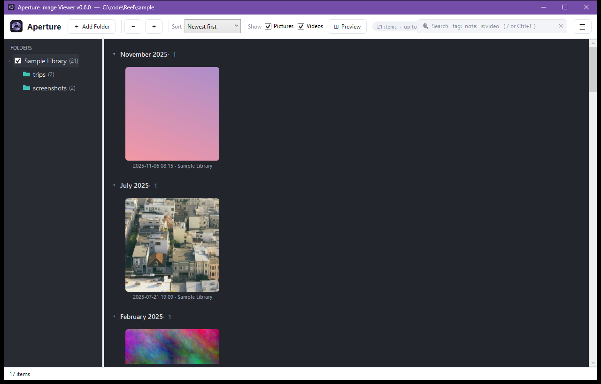

# Aperture Image Viewer

A fast, local image & video browser for Windows. It replaces File Explorer for the
"just let me look at my photos" case — no multi-second waits on big, image-heavy
folders like a Dropbox *Camera Uploads* or a *Screenshots* dump.

Aperture keeps a **persistent local index + thumbnail cache**, so the first scan of a
folder is the only slow one; every open after that paints instantly. Everything stays
on your machine — it never uploads anything or phones home.



---

## Highlights

- **Union across folders.** Add folders from anywhere on disk and browse them as one
  date-sorted view; per-folder include toggles and aliases.
- **Instant, virtualized grid** with five zoom levels (`Ctrl`+wheel / `Ctrl`+`±`) and
  square, center-cropped tiles.
- **Collapsible date sections** that auto-collapse older buckets, so you land on ~2
  screenfuls instead of scrolling forever.
- **Tags & notes** per file — stored locally, keyed by path, and kept across re-indexing.
  Multi-select tagging; a tag manager; **import/export** as portable JSON to move
  annotations between machines.
- **Gmail-style search:** `tag:beach`, `note:trip`, `is:video`/`is:image`, `type:mp4`,
  `has:tag`, `camera:`, `folder:`, quoted values (`tag:"date night"`), bare words match
  everywhere — all AND-ed, with `tag:` clauses OR-ed together.
- **Quick view** (`Space` / `Enter` / double-click) — a full-screen viewer with `←`/`→`
  paging; right-click for the full item menu.
- **Inspector pane** (dockable right or bottom) — large preview with zoom/pan, the item's
  tags & notes, and full EXIF/metadata.
- **Video thumbnails** via the Windows shell; open anything in its default app.
- **Keyboard-first, mouse-friendly.** Explorer-style arrow navigation, no modal dialogs on
  the hot paths. Window size/position/monitor and the folder-pane width are remembered.

---

## Getting started

The repo ships a small **sample library** so you can try it without pointing it at your
own photos:

1. Build & run (below).
2. Click **➕ Add Folder** and choose this repo's [`sample/`](sample) folder (or any subfolder).

### Build & run

Requires the **.NET 10 SDK**.

```powershell
dotnet build
dotnet run --project src/Aperture.App
dotnet test
```

Build a distributable single-file exe (needs the .NET 10 Desktop Runtime on the target):

```powershell
pwsh ./publish.ps1                 # framework-dependent (small)
pwsh ./publish.ps1 -SelfContained  # bundles the runtime (portable, larger)
```

→ `publish/Aperture.exe`

---

## Data & privacy

Everything is local. The index, thumbnail cache, and settings live in
`%LOCALAPPDATA%\Aperture` (`aperture.db`, `thumbs.db`, `settings.json`). Delete that folder
to reset from scratch. Set the `APERTURE_DATA_DIR` environment variable to relocate it.

> **Upgrading from the older "Reel" build?** On first launch Aperture moves an existing
> `%LOCALAPPDATA%\Reel` store into the new location automatically — your index and tags
> carry across, once.

---

## Architecture

- **`Aperture.Core`** — indexer, `FileSystemWatcher`, thumbnail pipeline, SQLite storage,
  search/sort/caption engine, models. No WPF references; unit-tested in isolation.
- **`Aperture.App`** — WPF UI with a small hand-rolled MVVM, grid virtualization, hotkeys,
  and dialogs.
- **`Aperture.Core.Tests`** — xUnit tests over indexing, thumbnails, orientation, the
  watcher, union queries, formatting, search, tags, multi-item merges, tag recency, the
  import/export round-trip, and the data migration.

Thumbnails decode with **SkiaSharp** (JPEG/PNG/HEIC/WEBP) with a Windows shell fallback for
exotic formats and video frames. EXIF via **MetadataExtractor**. Storage is raw
**Microsoft.Data.Sqlite** (metadata and thumbnail BLOBs split into two files so BLOBs don't
bloat the metadata page cache).

---

## Sample library

[`sample/`](sample) is a small, redistributable demo library — free-license photographs
from [Lorem Picsum](https://picsum.photos) (Unsplash License) plus original synthetic
images and a short video. Nothing there is anyone's personal photo. See
[`sample/NOTICE.md`](sample/NOTICE.md); regenerate with
[`scripts/make-sample.sh`](scripts/make-sample.sh).

---

## Status

Daily-driver quality on Windows, backed by 87 Core unit tests. Built as a series of
milestones (indexer/cache → union grid → sections/sort/captions → daily-driver polish)
plus many rounds of usage feedback; see the commit history for the full trail.
